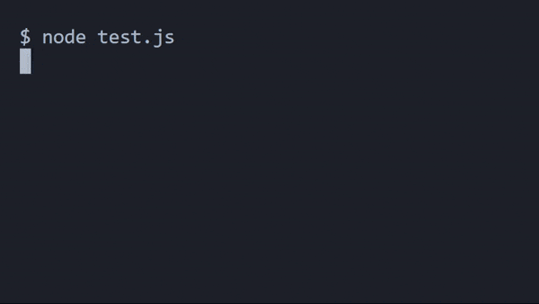

<h1 align="center">Logerian</h1>

### Description
Logerian is a logging utility made by [me](https://github.com/SwanX1)!
I made this logging utility mainly because I am too dumb to understand other loggers like [winston](https://www.npmjs.com/package/winston) and [signale](https://www.npmjs.com/package/signale).
If you're willing to contribute, please read [CONTRIBUTING.md](./CONTRIBUTING.md).

### Demo


### Usage
To use this logger, you can simply just create a new logger instance and it'll work.
It uses default options, which is the built-in `coloredLog` prefix, routing log levels correctly to stdout and stderr respectively:
```typescript
import { Logger } from "logerian"; // ES import
const { Logger } = require("logerian"); // CJS import

const logger = new Logger();

logger.info("Hello World!");
// Output: [17:43:01] [INFO] Hello World!
```

By default, the logger adds a prefix with a timestamp and log level as shown in the example code above.
If you wish to change that, you'll have to define a stream when you create the logger.
```typescript
const logger = new Logger({
  streams: [
    {
      stream: process.stdout,
    },
  ],
});

logger.info("foobar");
// Output: foobar
```

A logger can utilize multiple output streams:
```typescript
const logger = new Logger({
  streams: [
    {
      stream: process.stdout,
    },
    {
      stream: fs.createWriteStream("log.txt"),
    },
  ],
});

logger.info("Iron Man dies in Endgame");
// Output: Iron Man dies in Endgame
logger.info("Steve Rogers is old!!");
// Output: Steve Rogers is old!!
```
```conf
# log.txt
Iron Man dies in Endgame
Steve Rogers is old!!
```

There's also a neat thing called log levels!
```typescript
import { Logger, LoggerLevel } from "logerian";
const { Logger, LoggerLevel } = require("logerian");

const logger = new Logger({
  streams: [
    {
      level: LoggerLevel.WARN,
      stream: process.stdout,
    },
    {
      level: LoggerLevel.DEBUG, // Debug level is default
      stream: fs.createWriteStream("log.txt"),
    }
  ],
});

// Logs to both - stdout and log.txt
logger.error("Uh oh! There's an error!");

// Logs only to log.txt
logger.debug("By the way, there's an error because your code sucks!");
```

If you want to use pinned lines (as they're called in code), just use `logger.createPinnedLine`. The rest should be pretty easy to understand from the documentation

For advanced users, view the [JSDocs](https://swanx1.github.io/logerian).